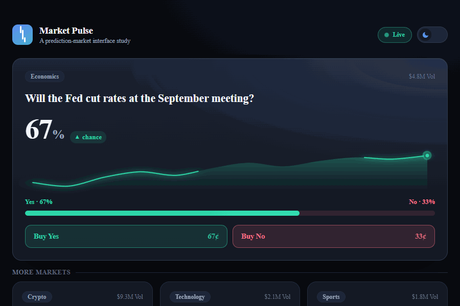

# Market Pulse

An interaction & motion study for **prediction-market** interfaces — built to explore the craft layer where design meets front-end engineering: live data, spring-driven motion, a token-based design system, and obsessive attention to the small stuff.



**Live demo:** _add your deploy URL here_ · **Stack:** React · Next.js (App Router) · TypeScript · Framer Motion

---

## What it shows

- **Live, spring-driven motion** — odds glide on a spring, the YES/NO bar springs to width, the sparkline draws itself in and a soft pulse tracks the live edge. Markets tick independently so the board feels organic, not synchronized.
- **A real design-token system** — every color, elevation, and radius lives in CSS custom properties. A dark/light theme switch flips one attribute and the whole UI re-themes; no component hard-codes a color.
- **Performance-minded** — animation runs on `transform`/`opacity`, `tabular-nums` stops the odds from reflowing, and the sparkline uses `vector-effect` to stay crisp under non-uniform scaling.
- **Accessibility / detail** — full `prefers-reduced-motion` support (springs become instant), visible focus rings, semantic markup, no layout shift on update.
- **TypeScript throughout** — typed market model and a small, pure tick simulation.

## Run locally

```bash
npm install
npm run dev      # http://localhost:3000
```

## Build (static export)

```bash
npm run build    # outputs a fully static site to ./out
```

## Deploy to Cloudflare Pages

This exports to plain static files, so it drops onto Cloudflare Pages (or GitHub Pages / Vercel) with no server:

- **Framework preset:** Next.js (Static HTML Export) — or "None"
- **Build command:** `npm run build`
- **Build output directory:** `out`

## Project structure

```
app/            layout, global tokens (globals.css), page
components/     MarketCard, OddsTicker, ProbabilityBar, Sparkline, BuyButtons, ThemeToggle, Header
lib/            markets (typed model + tick sim), motion (spring tokens), useLiveMarkets
```

> Data is simulated client-side — no network, no backend.

Built by [Clayton Young](https://github.com/Youngs-World).
